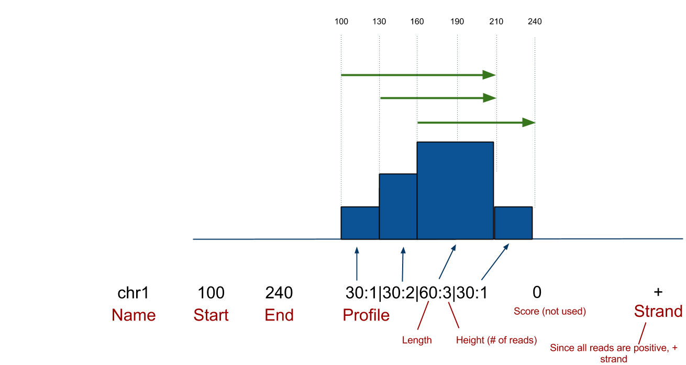

.. _intro:

Getting Started
===============

Download & Install
------------------

**Download Pyicoteo**  `Latest version`_ from our repository.

.. _`Latest version`: https://github.com/RegulatoryGenomicsUPF/pyicoteo/tags

.. _`Old Sourceforge repository`: http://sourceforge.net/projects/pyicos/ 

The command line tools can be used directly without installation. However, installation is recommended, and necessary if you intend to use the Pyicoteolib. To do so decompress the folder and run the setup.py script with administrator privileges::

    python setup.py install

Check installation
------------------

To test that the software was installed correctly, start a python console and try importing it by typing::

    python
    >>> import pyicoteolib
    >>> import pyicoteolib.core

Also, you should find the tools in your command line. 

*Tip: If you are in a Unix-like (GNU/Linux, FreeBSD, Mac) system, open a console, type "pyico" and tap TAB twice. You should see something like this*::

  pyicoclip        pyicoller        pyicos                    
  pyicoenrich      pyicoregion      pyicotrocol

Dependencies
----------------

In order to make it simple for the community, Pyicoteo basic functionality has no dependencies other than Python 2.6 or higher. However, there are two optional libraries you could install to obtain full functionality.

Matplotlib
^^^^^^^^^^

For plotting capabilities, it is necessary to install Matplotlib (> 1.0). 

Samtools
^^^^^^^^^

Also, for BAM reading, while we offer a native python implementation, you can ask Pyicoteo to read BAM using samtools with the flag ``--samtools``. 

Pyicoteo is not compatible with Python 3.

The bedpk format
----------------

Some Pyicoteo tools (Pyicos, Pyicoller and Pyicoclip) default experiment and output formats is a derivative of UCSC `Bed format <http://genome.ucsc.edu/FAQ/FAQformat.html#format1>`_ called bedpk. It follows the same starting fields "chromosome/tag start end" but it uses some of the original optional fields to include extra information. It is a cluster oriented format that aims to recollect information of a cluster of reads in a single comprehensive line. 

        The bedpk format specification. It is exactly like a BED6 format, but using the 4th column to store extra information about how the cluster was built. 

bedpk Column definition
^^^^^^^^^^^^^^^^^^^^^^^^^

1) Chromosome
2) Start coordinate
3) End coordinate
4) Profile: This field summarizes the accumulation of reads per nucleotide of the cluster. The first number is the number of bases covered, while the second will be the number of reads in those bases. See the example above
5) Height: The maximum height of the cluster. In this case, 3.
6) Strand: if **all** reads are on the positive strand ``+``, negative strand ``-``. If there are reads from both strands, the symbol will be ``.``
7) Summit: The position where the maximum height is found. The binding site is expected to be close to the summit.
8) Area: The area covered by the cluster.
9) p-value: The significance of the cluster calculated by the poisson operation based on peak heights or numbers of reads.

General and important flags
------------------------------

-f or --input-format
^^^^^^^^^^^^^^^^^^^^^^^

Format desired for the input. You can choose between eland, bed, bed_wig, bed_pk, sam, bam, counts and custom text file. Depending on the tool used, some formats will not be available. 

-F or --output-format
^^^^^^^^^^^^^^^^^^^^^^^^

Format desired for the output. You can choose between eland, bed, bed_wig, bed_pk, sam, counts and custom text file. Depending on the tool used, some formats will not be available. 

Disk usage flags
^^^^^^^^^^^^^^^^^^

The tools in Pyicoteo Suite follow the principle of minimal memory usage. Because of this, Pyicoteo makes heavy use of disk and temporary files. You should make sure that you have at least double the space of each file in your hard drive before using Pyicoteo. Also, please take into consideration the following flags:

``--tempdir``
""""""""""""""""""

Pyicoteo uses the default temporary directory in the system (in many Unix based system, the content of the variable $TEMPDIR, normally /tmp). You can change the temporary directory with this flag.

``--keep-temp``
""""""""""""""""""

Pyicoteo tries to delete all unnecesary temporary files. If you want to keep the files in order to check them reuse them (for example, the sorted files could be useful in combination of the ``--no-sort`` flag) or delete them, use this flag

``--postscript``
""""""""""""""""""

If you want to get a postscript output on your plots instead of png.

``--showplots``
""""""""""""""""""

To launch matplotlib interactive mode instead of saving the resulting plot. 

Questions and Support
---------------------

If you have any problems or suggestions please join the `Pyicoteo Google Group`_ and ask! 

.. _`Pyicoteo Google Group`: http://groups.google.com/group/pyicoteo