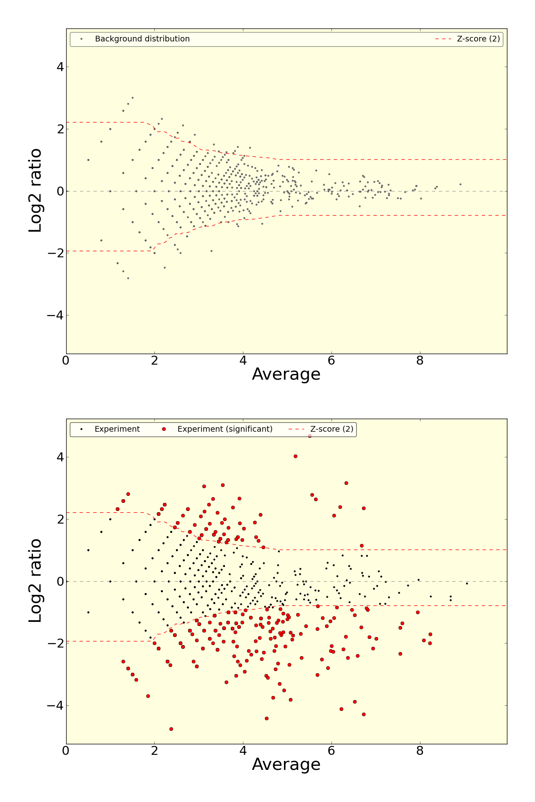
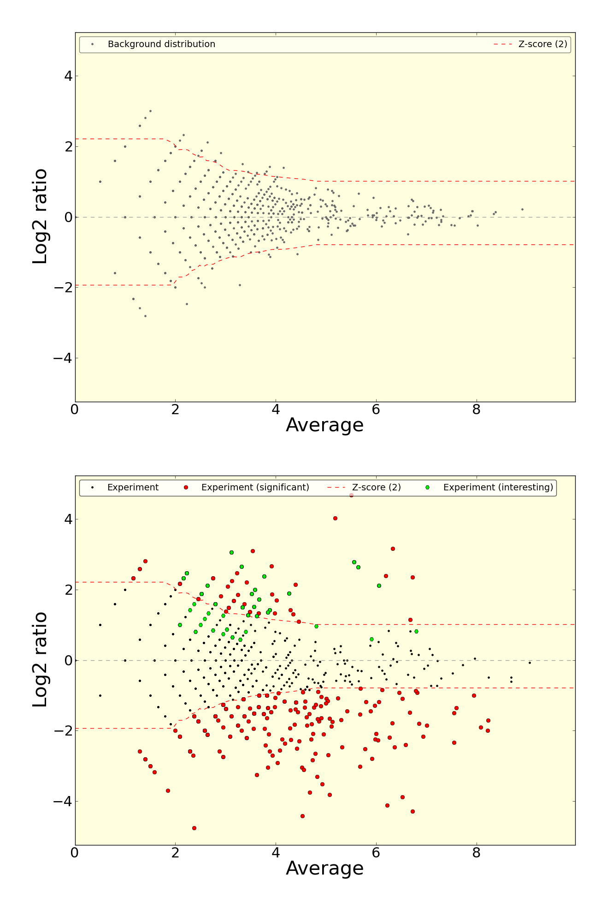

.. _Pyicoenrich:

Pyicoenrich
===========

Enrichment analysis can be applied on any type of -seq data. Pyicoenrich performs enrichment analysis on sequenced reads from two conditions. You can find out how significant the difference of these two conditions is in terms of the number of reads overlapping a region of interest. 

Basic usage
-----------

``Pyicoenrich`` usage requires the experiment files in reads format (BED, SAM/BAM, Eland...). 

Example::

    pyicoenrich -reads condition_a.bed condition_b.bed -output output.pk -f bed --region my_regions.bed 

Alternatively, you can provide a counts file with the already calculated read counts for the interesting regions (see :ref:`countsformat`)::

    pyicoenrich -counts a_and_b.counts -output result.out  

``Pyicoenrich`` scoring system is based on the MA-Plot_. The main idea behind it is that regions with less saturation (smaller A, left side of the x axis) are less reliable to detect differential enrichment. Every point in the MA-plot represents a region, the y axis is the log2 ratio of the normalized reads in the region (M value), while the mean number of reads in a region is the average of the normalized log2 counts (A value). 

.. _MA-Plot: http://en.wikipedia.org/wiki/MA_plot

    Each point represents a region. The top plot is the background comparison (either technical or using replicas), the bottom one is the comparison between the 2 conditions. The distribution of the regions in the background (up) is used to calculate the Z-scores on the comparison of the 2 conditions (down). 

In both cases, the result file will be in :ref:`countsformat` 

Region exploration
-----------------------

If a region file is provided, Pyicoenrich returns for each region a Z-Score (See counts file description) which indicates the enrichment/depletion of condition A over condition B. If no region file is provided, Pyicoenrich provides the options to take the union of reads from both conditions as a region and gives back Z-Scores for the generated regions. As regions with 0 reads in one condition might be especially interesting. 

In order to decide what regions are to be explored, you have 3 main options:

Generate a file with the ``--region-magic`` flag and GTF file
""""""""""""""""""""""""""""""""""""""""""""""""""""""""""""""""""

See the :ref:`Pyicoregion` documentation for examples on how to use ``--region-magic`` flag to automatically explore exons, introns and the whole genome using sliding windows automatically generating your region files from standard GENCODE GTF files. 

Provide a regions file
""""""""""""""""""""""""""""""""""""""""""""""""""""""""""""""""""

If a region file is provided, Pyicoenrich returns for each region a z-Score (among others) which indicates the enrichment/depletion of condition A over condition B. The region file should be in BED format. Also, you may consider only discontinuous regions by using the BED12 format::

        pyicoenrich -reads kidney1.bed liver1.bed -output Pyicoenrich_Kidney_Liver_result_Counts -f bed --region genes.bed

Do nothing
""""""""""""""""""""""""""""""""""""""""""""""""""""""""""""""""""

If no region file is provided, Pyicoenrich will automatically generate one with taking he union of reads from both conditions as a region and gives back Z-Scores for the generated regions. 

The flag ``--proximity`` controls the distance with which the regions are considered "joined". Default is 50nt::

        pyicoenrich -reads kidney1.bed liver1.bed -output Pyicoenrich_Kidney_Liver_result -f bed --proximity 50nt

.. figure:: images/region_definition.png

Important flags
--------------------

This is a description of the most important flags. To see the complete list of flags, type ``pyicoenrich -h`` to get the full list.

``--interesting-regions``
""""""""""""""""""""""""""""""""""""

Providing a list of interesting regions matching the 4th column of the regions file (using ``-reads``) or count file (using ``-counts``) will highlight them in the MA plot. 

    Example of an enrichment output plot using ``--interesting-regions``.

Assuming that we are using reads, a region file named ``regions.bed`` and a list of interesting regions ``interreg.txt``, this is how the files will look like.

Region file (regions.bed)::

    chr1    1     100     region1    0    .
    chr1    1000  1100    region2    0    .
    chr10   1     100     region3    0    .    
    ...
    chrN    x     y       regionN    0    . 

Interesting regions file (interreg.txt)::

    region2
    region10
    ...
    regionZ

Example command::

    pyicoenrich -reads kidney1.bed liver1.bed -output rpkm_norm.enrich -f bed --region genes.bed --interesting-regions interreg.txt

``--pseudocounts`` 
""""""""""""""""""""""""""""""""""""

As regions with 0 reads in one condition might be especially interesting, Pyicoenrich can use pseudocounts, in order to avoid a division by 0: Pyicoenrich calculates the ratio of number of reads in both conditions. As there might not be any reads in a region, Pyicoenrich assumes that there is already 1 read in each region in each condition.

``--stranded`` 
""""""""""""""""""""""""""""""""""""

To take into consideration reads that coincide with the strand direction of the regions (6th column in your BED6 file)

   
Normalization flags
------------------------

Pyicoenrich included several popular normalization methods for the counts.

    **PUBLIC SERVICE ANNOUNCEMENT:** When dealing with normalization methods, one has to be very careful. 
    There is no silver bullet, you need to understand your data and then apply the method that is appropriate for it. 
    If you are in doubt, please consult your local statistician.

MA calculation adjustment
"""""""""""""""""""""""""""

The different z-scores values are calculated using a sliding through the region points left to right in the y axis (smaller to greater saturation of reads). You can tweak this calculation using the ``--binsize`` and ``--binstep``

.. option:: --binsize

The size of the bins to calculate the local sd and mean for the background model, as a ratio of total number or regions. Regardless of the ratio selected, the minimum window size is 50 regions, since below that threshold the results will no longer be  statistically meaningful. The default bin size is 0.3 (30% of the region points.)

.. option:: --binstep

Step of the sliding window for the calculation of the z-score, as a ratio of the window size selected. Closer to 0 values will provide better precision, but slower performance, closer to 1 less precision but faster calculation. Default slide is 0.1 (10% of the total regions)

Total reads normalization (``--n-norm``)
"""""""""""""""""""""""""""""""""""""""""""

This normalization will calculate the *number of reads per million reads* in each region and sample. This is a *very simple* normalization that tries to correct the bias of comparing different samples by total number of reads. You can activate it with the ``--n-norm`` flag.

Example. Using 2 reads files, calculate the enrichment normalizing by N ::

    pyicoenrich -reads kidney1.bed liver1.bed -output n_norm.enrich -f bed --region genes.bed --n-norm

If you want to skip the total reads calculation step, you can provide the total number of reads with the following flags.

.. option:: --total-reads-a
                        
.. option:: --total-reads-b 

.. option:: --total-reads-replica 

Example:: 

    pyicoenrich -reads kidney1.bed liver1.bed -output n_norm.enrich -f bed --region genes.bed --n-norm --total-reads-a 120000 --total-reads-b 110000

Region length normalization (``--len-norm``)
""""""""""""""""""""""""""""""""""""""""""""""

Calculates the number of reads per **region** kilobase. It aims to correct for regions with different lengths. 

NOTE: If possible, try not to mix regions with different lengths. 

pyicoenrich -reads kidney1.bed liver1.bed -output n_norm.enrich -f bed --region genes.bed --n-norm

RPKM (``--len-norm`` and ``--n-norm``)
"""""""""""""""""""""""""""""""""""""""""""

The popular RPKM normalization is the combination of both ``--n-norm`` and ``--len-norm``::

    pyicoenrich -reads kidney1.bed liver1.bed -output rpkm_norm.enrich -f bed --region genes.bed --n-norm --len-norm

Trimmed Means of M values normalization (``--tmm-norm``)
"""""""""""""""""""""""""""""""""""""""""""""""""""""""""""

As proposed by EdgeR_. 

.. _EdgeR: http://genomebiology.com/2010/11/3/R25

This calculates the weighted trimmed mean of the log expression ratios (trimmed mean of M values (TMM)). It is based on the hypothesis that most of your regions do not change, and calculates a normalization factor by excluding the total amount of data. 

Important flags.

.. option:: --a-trim    

    Proportion of A values to be discarded when doing the
    
    TMM normalization. [Default 0.05]

.. option:: --m-trim   

    Proportion of M values to be discarded when doing the

    TMM normalization. [Default 0.25]

Example: TMM normalization calculated discarding the 20% smaller A (less read coverage) and 5% of the regions with the biggest differences (up and down)::

    pyicoenrich -reads kidney1.bed liver1.bed -output rpkm_norm.enrich -f bed --region genes.bed --tmm-norm --a-trim 0.2 --m-trim 0.05

Full quantile normalization (``--quant-norm``)
""""""""""""""""""""""""""""""""""""""""""""""""""""

This method is suitable when your samples have too much variability. As eloquently put by Simplystatistics_

.. _Simplystatistics: http://simplystatistics.org/2013/04/26/mindlessly-normalizing-genomics-data-is-bad-but-ignoring-unwanted-variability-can-be-worse/

.. _countsformat:

Input Counts file
-------------------

You can provide pyicoenrich a count file instead of read files. The required file is a text file with the following columns::

    1) name                    =  region label (chromosome, gene name, transcript...) 
    2) start                   =  region start coordinates
    3) end                     =  region end coordinates
    4) name2                   =  alternative label 
    5) score                   =  Reserved by a "." as it is used by the UCSC browser for coloring. 
    6) strand                  =  region strand. Options are ``+`` for positive strand, ``-`` for negative strand and ``.`` for none
    7) signal_a                =  Counts in experiment A (normalized)
    8) signal_b                =  Counts in experiment B (normalized)
    9) signal_prime_1          =  Counts in experiment A (exactly the same as signal_a) or random background 1 (normalized) 
    10) signal_prime_2         =  Counts in experiment replica A or random background 2 (normalized if used) 

Output Counts file 
---------------------

The output of pyicoenrich will look as follows. Column description of enrichment result where each line describes a region::

    For columns 1-10, see above. 

    11) A                      =  (log2(signal_a)+log2(signal_b))/2
    12) M                      =  log2(signal_a/signal_b)
    13) total_reads_a          =  total number of reads in sample a
    14) total_reads_b          =  total number of reads in sample b
    15) num_tags_a             =  number of reads in sample a overlapping the region
    16) num_tags_b             =  number of reads in sample b overlapping the region
    17) A_prime                =  (log2(signal_prime_1)+log2(signal_prime_2))/2    
    18) M_prime                =  log2(signal_prime_1/signal_prime_2)   
    19) total_reads_a          =  total number of reads in sample a
    20) total_reads_b          =  total number of reads in sample b
    21) total_reads_prime_1    =  total number of reads in sample prime 1 
    22) total_reads_prime_2    =  total number of reads in sample prime 2
    23) A_median               =   median of A values in window
    24) mean                   =   mean of M_prime values in window
    25) sd                     =   standard deviation of M_prime values in window
    26) zscore                 =  score for the significance of the difference of enrichment between condition a and b compared to prime 1  and prime 2 

Credit
------

* Developers: Juan González-Vallinas, Ferran Lloret
* Beta Testing: Sonja Althammer, Eneritz Agirre, Nuria Conde Pueyo, Juan González-Vallinas
* Benchmarking against other DE methods: Sonja Althammer
* Speed and memory performance benchmarking: Juan González-Vallinas
* Supervision: Eduardo Eyras
