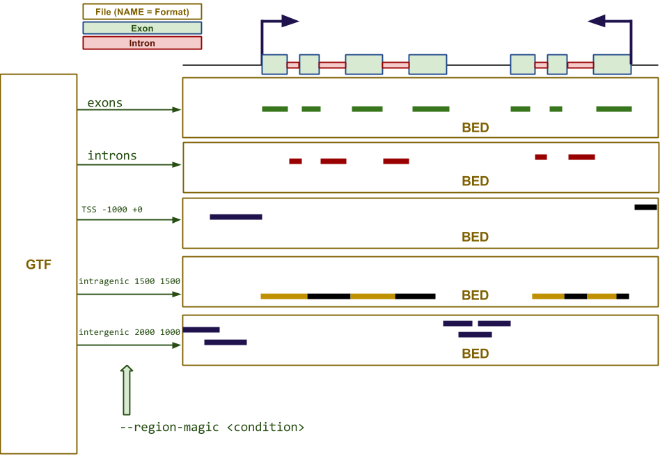

.. _Pyicoregion:

Pyicoregion
===========

 intragenic or intergenic windows, exons, introns, TSS...

Pyicoregion is a Pyicoteo module for processing region files. Its input is GFF files as the Sanger Institute defines_ it. The main function of this tool is to generate exploratory region files like sliding windows of arbitrary length in the intergenic and intragenic spaces, exons, introns, TSS of any genome in existance. The following drawing illustrates the different region files that can be generated by the tool:

.. _defines: http://www.sanger.ac.uk/resources/software/gff/spec.html

Examples::

    #Using the last GENCODE annotation file, output exons as a SAM file.
    pyicoregion --region-magic tss 1000 2000 -F sam --gff-file gencode.v11.bed

    #Using the last GENCODE annotation file, output all regions around TSS 1000 bases upstream and 2000 bases downstream as a BED file.
    pyicoregion --region-magic tss 1000 2000 -F bed --gff-file gencode.v11.bed

Pyicoregion arguments
---------------------

.. option:: --region-magic

    .. describe:: exons [position]

        Returns all the exons in the region file.

        If the optional argument ``[position]`` is specified (possible values: ``first``, ``last``), it will only return the first or last exon of every gene.

    .. describe:: introns [position]

        Returns all the introns in the region file.

        If the optional argument ``[position]`` is specified (possible values: ``first``, ``last``), it will only return the first or last intron of every gene.

    .. describe:: slide <window_size> <window_step> <region_type> [chromlen_file_path]

        Searches for intergenic and intragenic regions using sliding windows.

        Mandatory arguments are ``<window_size>`` (the size of the sliding window), ``<window_step>`` (the distance between the start position of every consecutive window. It must be lower than or equal to the window size) and ``<region_type>`` (must be ``inter``, for intergenic, or ``intra``, for intragenic regions).

        The optional argument ``[chromlen_file_path]`` is used to specify the path to the file containing the chromosome lengths (Pyicoteo's own chromlen files can be found in pyicoteolib/chromlen/). If it is not specified for intergenic regions, the results for the last regions of the chromosomes might be wrong.

        Note: if the last segment of a region is shorter than the window size, the step distance is decreased by the difference (the window size stays the same).

        Note: regions shorter than the window size are ignored.

    .. describe:: tss <add_start> <add_end>

        Returns the TSS for every transcript in the region file.

        Due to a TSS being a single point, the arguments ``<add_start>`` and ``<add_end>`` specify the values added to the start and end of every TSS (taking into consideration the strand). For pyicoregion to work correctly, they must be non-negative integers. Also, if the strand is not specified, the regions will be treated as if they were positive.

.. option:: --gff-file <gff_file_path>

    Used to specify the path of the GFF file containing the regions. This argument is mandatory for all operations involving regions.

Examples
--------

Generate a BED file with all introns::

    .. pyicoregion my_reference.gff output_introns.bed --region-magic introns 

Credit
-------

* Developer: Ferran Lloret
* Unit and beta Testing: Juan González-Vallinas, Ferran Lloret
* Supervision: Eduardo Eyras
