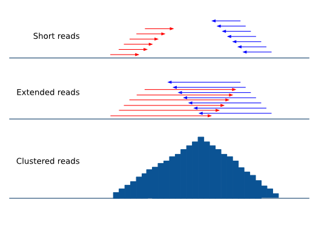

.. _Pyicos:

Pyicos
========

Pyicos is a command line utility for the conversion and manipulation of genomic coordinates files. It follows a command/sub-command structure

In the interactive help you can visualize the available commands list::

    pyicos -h

If you are interested in the usage of a particular command (for example, 'extend') and the meaning of its flags type::

    pyicos extend -h

Here we explain briefly what each subcommand does and we give some examples::

convert
-------

Converting a file from one format to another format. Currently supported formats are: 

experiment: Bed, Wiggle files (bed_wiggle), SAM, BAM, Eland, bedpk (Pyicos default compressed format), bedspk (Pyicos stranded compressed format)

output: Bed, Wiggle files (bed_wiggle, variable_wiggle), SAM, BAM, Eland, bedpk (Pyicos default compressed format)

This operation is useful if you only want to convert your data to another format. Other operations already include a conversion if you specify different experiment and output formats.

Convert a bed file to a half-open variable wig file::

    pyicos convert my_experiment.bed my_experiment.wig -f bed -F variable_wig -O

Convert all pk files in a folder to bed wig files::

    pyicos convert my_experiment_folder/ outputfolder/ -F bed_wig

remregions
------------
Remove regions that overlap with the regions in the "black list" file. 

Example::

    pyicos remregions my_experiment.bed regions.bed my_result.bed --experiment-format bed --open-experiment --region-format bed --open-region --output-format bed --open-output 

remduplicates
-------------------
Remove the duplicated reads in a file. A duplicate is a read with the same start position as a read that has already been seen. You can choose how many duplicates you want to tolerate. If you want to keep only one read for a start position, set the duplicates to 0.

Example:

Here we tolerate 1 duplicate so a read can not occur more often than twice::

    pyicos remduplicates my_experiment.bed my_experiment_1dupl.bed --duplicates 1 -f bed -o -F bed

.. _strcorr:

strcorr (Strand Correlation)
--------------------------------
Finds the optimal extension value by finding the "gap" between groups of positive and negative cluster of reads by performing a pearson correlation test.

extend
------
Extend the reads to the estimated fragment length, taking into consideration if they map to the forward or reverse strand of the reference genome.

Examples:

We have a bed file (half open) with reads between 30 and 50 nucleotides long. We want to extend them all to 150 nucleotides and write the output in bedpk-format to accelerate the successive operations::

    pyicos extend my_experiment.bed my_experiment_ext.bedpk 150 -f bed -o

We do the same with the control::

    pyicos extend control.bed control_ext.bedpk 150 -f bed -o

To visualize the data in a genome browser we set the output to be half-open bed_wig::

    pyicos extend my_experiment.bed my_experiment_ext.bed_wig 150 -f bed -o -F bed_wig -O

subtract
---------
Subtract the reads in one file from the reads in another file. Using background data (control) improves the results because the background distribution is not supposed to be normal, 
and statistical approaches to obtain this have a limited reach.

The most straightforward approach is to subtract the control from the sample. Make sure the sample has been **normalized** to the control beforehand!
Pyicos maintains a 1bp resolution by subtracting the reads nucleotide by nucleotide, rather than doing a statistical approximation. 
Operating with directories will only give appropiate results if the files and the control are paired in alphabetical order.

Example:

Subtract the control from the experiment (both have already been extended, converted to bedpk and normalized)::

    pyicos subtract my_experiment_ext_norm.bedpk control_ext.bedpk my_experiment_ext_norm_subtr.bedpk 

split
-----
Split peaks into subpeaks in case they fulfill the criteria.

Criteria: peak has at least two neighboring maxima between which the coverage of reads falls below the threshold. The threshold can be set by the user and it reflects a proportion of the lower maximum. 

Output: bedpk or Wiggle files

.. figure:: images/Split.png

Example::

    pyicos split peaks.bedpk peaks_split.bedpk --split-proportion 0.9

discard
-------
Discards peaks that look like artifacts due to the sequencing bias. Here we refer to peaks that look like blocks that result from duplicates (reads with the same start position). 

Output: bedpk or Wiggle files

.. figure:: images/Artifact.png

Example::

    pyicos discard peaks.bedpk peaks_discA.bedpk 

filter
------
Detect and select significant clusters in the file. There are two steps in this operation: Through the poisson operation the thresholds are determined. Next the peaks are filtered according to these thresholds.

Output: bedpk or Wiggle files

Example::

    pyicos filter peaks.bedpk significant_peaks.bedpk 150 

push
----
Push the reads in the corresponding strand. If a read doesn\'t have a strand, it will be pushed from left to right.

This operation requires tag-like files (bed, eland, sam).

Example::

    pyicos push my_experiment.bed my_experiment_pushed100.bed 100 -f bed -F bed

Credit
------

* Developer: Juan González-Vallinas
* Beta Testing: Eneritz Agirre, Sonja Althammer, Juan González-Vallinas
* Supervision: Eduardo Eyras
