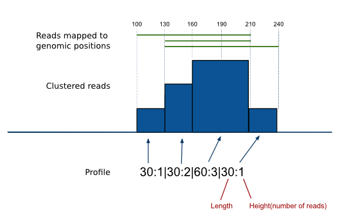

Basic Concepts
==============

.. What is commented is still in construction or will be kept as a secret before we publish. 

Nomenclature
----------------
experiment = file containing data of the actual experiment (the evidence of the binding event you are interested in)
control = file containing background data
output = resulting file from operation(s) of choice; the user chooses the name of this file.

The bedpk format
----------------

Pyicoteo tools Pyicos, Pyicaller and Pyicoclip default experiment and output format is a derivative of UCSC `Bed format <http://genome.ucsc.edu/FAQ/FAQformat.html#format1>`_. It follows the same starting fields "chromosome/tag start end" but it uses some of the original optional fields to include extra information. It is a cluster oriented format that aims to recollect information of a cluster of reads in a single comprehensive line. 

..

Explanation of the content in the columns:

1) Chromosome
2) Start coordinate
3) End coordinate
4) Profile: This field summarizes the accumulation of reads per nucleotide of the cluster. The first number is the number of bases covered, while the second will be the number of reads in those bases. See the example above
5) Height: The maximum height of the cluster. In this case, 3.
6) Strand: if ALL clusters reads are positive strand "+", if they are all negative "-". Otherwise "."
7) Summit: The position where the maximum height is found. The binding site is expected to be close to the summit.
8) Area: The area covered by the cluster.
9) p-value: The significance of the cluster calculated by the poisson operation based on peak heights or numbers of reads.
