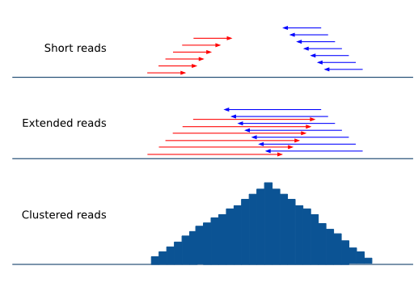
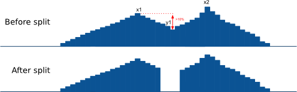
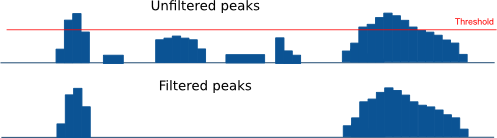
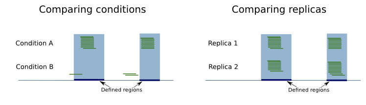
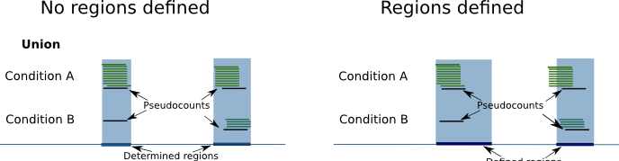
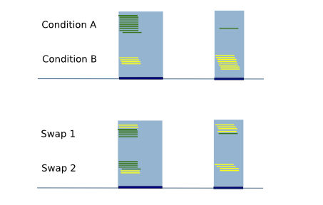

pyicos command line operations
======================================================

To apply operations individually you can use the command line.

By running the commands step by step you have the advantage of transparency: You can check the differences from before and after each step (for example by uploading wiggle tracks to a genome browser). Like that you see exactly how the operation modified your data.

To see the ways of usage and a list of the subcommands you can access the command line **help** by typing:

    pyicos -h

If you are interested in the usage of a particular command (for example, 'extend') and the meaning of its flags type:

    pyicos extend -h

Here we explain briefly what each operation does and we give some examples::

remregions
-------------------
Remove regions that overlap with the regions in the "black list" file. Here usually satellites and centromers are listed.

Example::

    pyicos remregions my_experiment.bed regions.bed my_result.bed --experiment-format bed --open-experiment --region-format bed --open-region --output-format bed --open-output 

You can also use the abbreviated syntax. This command is synonimous of the previous one::

    pyicos remregions my_experiment.bed regions.bed my_result.bed -f bed -o --region-format bed --open-region -F bed -O 

remduplicates
-------------------
Remove the duplicated reads in a file. A duplicate is a read with the same start position as a read that has already been seen. You can choose how many duplicates you want to tolerate. If you want to keep only one read for a start position, set the duplicates to 0.

Example:

Here we tolerate 1 duplicate so a read can not occur more often than twice::

    pyicos remduplicates my_experiment.bed my_experiment_1dupl.bed --duplicates 1 -f bed -o -F bed

.. labelremove
.. -----------
.. Remove all lines that have the specified tag from the file. 
.. 
.. Example:
.. 
.. From a SAM file, delete every entry that has has been mapped to chromosome22 and chromosome4::
.. 
..     pyicos labelremove my_experiment.sam no_chr4_chr22.sam chr4:chr22 --experiment-format sam --output-format sam

strcorr (Strand Correlation)
--------------------------------
Finds the optimal extension value by finding the "gap" between groups of positive and negative cluster of reads by performing a pearson correlation test.

extend
------
Extend the reads to the estimated fragment length, taking into consideration if they map to the forward or reverse strand of the reference genome.

Examples:

We have a bed file (half open) with reads between 30 and 50 nucleotides long. We want to extend them all to 150 nucleotides and write the output in bedpk-format to accelerate the successive operations::

    pyicos extend my_experiment.bed my_experiment_ext.bedpk 150 -f bed -o

We do the same with the control::

    pyicos extend control.bed control_ext.bedpk 150 -f bed -o

To visualize the data in a genome browser we set the output to be half-open bed_wig::

    pyicos extend my_experiment.bed my_experiment_ext.bed_wig 150 -f bed -o -F bed_wig -O

.. normalize
.. ---------
.. When comparing different data sets to each other (for example experiment and control), normalizing is a necessary step to make them comparable. Pyicos takes into account the number of reads and their lengths and operates on a nucleotide precision level.
.. 
.. Example:
.. 
.. Normalize the experiment to the control (both have already been extended and converted to bedpk)::
.. 
..     pyicos normalize my_experiment_ext.bedpk control_ext.bedpk my_experiment_ext_norm.bedpk 

subtract
---------
Subtract the reads in one file from the reads in another file. Using background data (control) improves the results because the background distribution is not supposed to be normal, 
and statistical approaches to obtain this have a limited reach.

The most straightforward approach is to subtract the control from the sample. Make sure the sample has been **normalized** to the control beforehand!
Pyicos maintains a 1bp resolution by subtracting the reads nucleotide by nucleotide, rather than doing a statistical approximation. 
Operating with directories will only give appropiate results if the files and the control are paired in alphabetical order.

Example:

Subtract the control from the experiment (both have already been extended, converted to bedpk and normalized)::

    pyicos subtract my_experiment_ext_norm.bedpk control_ext.bedpk my_experiment_ext_norm_subtr.bedpk 

split
-----
Split peaks into subpeaks in case they fulfill the criteria.

Criteria: peak has at least two neighboring maxima between which the coverage of reads falls below the threshold. The threshold can be set by the user and it reflects a proportion of the lower maximum. 

Output: bedpk or Wiggle files

Example::

    pyicos split peaks.bedpk peaks_split.bedpk --split-proportion 0.9

discard
-------
Discards peaks that look like artifacts due to the sequencing bias. Here we refer to peaks that look like blocks that result from duplicates (reads with the same start position). 

Output: bedpk or Wiggle files

.. figure:: images/Artifact.png

Example::

    pyicos discard peaks.bedpk peaks_discA.bedpk 

poisson
-------

This is the test to assess significance of peaks along the whole genome (as for ChIP-Seq). We do 3 different global poisson statistical tests for each chromosome in a file:

 
    **Max height analysis**

    Lambda is calculated from the maximum heights of the clusters by calculating the average height of a cluster in a given region. Pyicos will obtain the p-value_height of one cluster having a height k by chance.

    **Number of reads analysis**

    Lambda is obtained from the number of reads in clusters.

    **Nucleotide analysis**

    Lambda is obtained from the number of nucleotides in a cluster. 

Example::

    pyicos poisson peaks.bedpk

filter
------
Detect and select significant clusters in the file. There are two steps in this operation: Through the poisson operation the thresholds are determined. Next the peaks are filtered according to these thresholds.

Output: bedpk or Wiggle files

Example::

    pyicos filter peaks.bedpk significant_peaks.bedpk 150 

modFDR
-------
Use the modified False Discovery Rate method proposed_ by Yeo et al. to determine which clusters are significant in a list of genomic regions (like genes or transcripts). This method is typically used in CLIP-Seq data that doesn't have a valid control experiment to compare against. 

A region of interest file is required for the method to be applied, in BED format. 

.. _proposed: http://www.nature.com/nsmb/journal/v16/n2/full/nsmb.1545.html

Example::

    pyicos modfdr my_experiment.bed my_regions.bed output.pk -f bed 

convert
-------
Converting a file from one format to another format. Currently supported format are: 

experiment: Bed, Wiggle files (bed_wiggle), SAM, Eland, bedpk (Pyicos default compressed format), bedspk (Pyicos stranded compressed format)

output: Bed, Wiggle files (bed_wiggle, variable_wiggle), SAM, Eland, bedpk (Pyicos default compressed format), bedspk (Pyicos stranded compressed format)

This operation is useful if you only want to convert your data to another format. Other operations already include a conversion if you specify different experiment and output formats.

Examples:

Convert a bed file to a half-open variable wig file::

    pyicos convert my_experiment.bed my_experiment.wig -f bed -F variable_wig -O

Convert all pk files in a folder to bed wig files::

    pyicos convert my_experiment_folder/ outputfolder/ -f pk -F bed_wig

callpeaks
---------
This command is a combination of previous commands (extend, normalize, subtract, remove, poisson and filter) for the task of calling peaks from a ChIP-Seq experiment (With and without control). 

Example::

    pyicos callpeaks my_experiment.bed significant_peaks.bedpk -f bed -o --control control.bed --control-format bed --open-control --region regions_to_be_removed.bed --remlabels chrY --correction 0.8 --k-limit 20 --p-value 0.001 -x 130

enrichment
---------
Enrichment analysis can be applied on any type of -seq data. Pyicos performs enrichment analysis on sequenced reads from two conditions. Like this you can find out how significant the difference of these two conditions is, in terms of the number/density of reads overlapping a region of interest. For example, you might expect significant differences between different conditions, while you would not expect significant differences between biological replicas. Based on this assumption Pyicos calculates Z-Scores for each region of interest. If no replicas are provided Pyicos creates technical replicas (see below).

If a region file is provided, Pyicos returns for each region a Z-Score (among others) which indicates the enrichment/depletion of condition A over condition B. If no region file is provided, Pyicos provides the options to take the union of reads from both conditions as a region and gives back Z-Scores for the generated regions. As regions with 0 reads in one condition might be especially interesting, Pyicos can use pseudocounts, in order to avoid a division by 0: Pyicos calculates the ratio of number of reads in both conditions. As there might not be any reads in a region, Pyicos assumes that there is already 1 read in each region in each condition.

To calculate the Z-Score, Pyicos compares the differences between condition A and condition B with the differences between A and A' (while A' is the biological replica of A). If no biological replica is available, Pyicos uses a sample swap as a reference. With sample swap we mean that reads from condition A and B are mixed randomly and divided in two sets (with size of those of A and B). In the two resulting sets we do not expect any significant differences, just like in replicas.  

Column description of enrichment result where each line describes a region: 
name	start	end	name2	score	strand	signal_a	signal_b	signal_prime_1	signal_prime_2	A	M	total_reads_a	total_reads_b	num_tags_a	num_tags_b	A_prime	M_prime	total_reads_a	total_reads_b	total_reads_background_1	total_reads_background_2	A_median	mean	sd	zscore

1) name                    =  chromosome of region

2) start                   =  region start

3) end                     =  region end

4) name2                   =  alternative label for the region, useful to put the gene name on it

5) score                   =  Reserved by a "." as it is used by the UCSC browser for coloring. 

6) strand                  =  region strand

7) signal_a                =  Counts in experiment A (normalized if used)
 
8) signal_b                =  Counts in experiment B (normalized if used)

9) signal_prime_1          =  Counts in experiment A (exactly the same as signal_a) or random background 1 (normalized if used) 

10) signal_prime_2         =  Counts in experiment replica A or random background 2 (normalized if used) 

11) A                      =  (log2(signal_a)+log2(signal_b))/2

12) M                      =  log2(signal_a/signal_b)

13) total_reads_a          =  total number of reads in sample a

14) total_reads_b          =  total number of reads in sample b

15) num_tags_a             =  number of reads in sample a overlapping the region

16) num_tags_b             =  number of reads in sample b overlapping the region

17) A_prime                =  (log2(signal_prime_1)+log2(signal_prime_2))/2    

18) M_prime                =  log2(signal_prime_1/signal_prime_2)   

19) total_reads_a          =  total number of reads in sample a

20) total_reads_b          =  total number of reads in sample b

21) total_reads_prime_1    =  total number of reads in sample prime 1 

22) total_reads_prime_2    =  total number of reads in sample prime 2

23) A_median	           =   median of A values in window

24) mean	               =   mean of M_prime values in window

25) sd	                   =   standard deviation of M_prime values in window

26) zscore                 =  score for the significance of the difference of enrichment between condition a and b compared to prime 1  and prime 2 
          

Examples::

    # Calculations based on count data:    
    pyicos enrichment kidney1.bed liver1.bed Pyicos_Kidney_Liver_result_Counts -f bed --region genes.bed --open-region --stranded --replica kidney2.bed --pseudocount --skip-header
   
    # Calculations based on count data normalized by number of reads in sample:    
    pyicos enrichment kidney1.bed liver1.bed Pyicos_Kidney_Liver_result_Counts -f bed --region genes.bed --open-region --stranded --replica kidney2.bed --pseudocount --skip-header --n-norm 

    # To use RPKM normalization    
    pyicos enrichment kidney1.bed liver1.bed Pyicos_Kidney_Liver_result_RPKM -f bed --region genes.bed --open-region --stranded --replica kidney2.bed --pseudocount --skip-header --n-norm --len-norm

    # To use TRPK normalization 
    pyicos enrichment kidney1.bed liver1.bed Pyicos_Kidney_Liver_result_RPKM -f bed --region genes.bed --open-region --stranded --replica kidney2.bed --pseudocount --skip-header --n-norm --len-norm --tmm-norm

push
----
Push the reads in the corresponding strand. If a read doesn\'t have a strand, it will be pushed from left to right.

This operation requires tag-like files (bed, eland, sam).

Example::

    pyicos push my_experiment.bed my_experiment_pushed100.bed 100 -f bed -F bed

